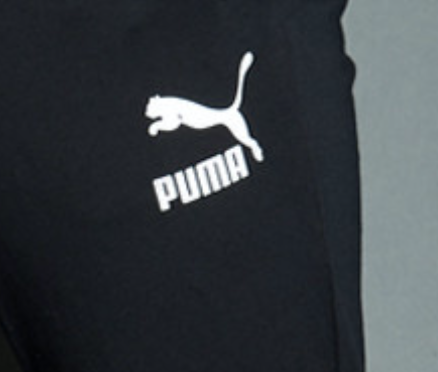

::: tip 赏一杯
如果你觉得这个项目对你有所帮助，你可以帮作者买一杯咖啡以表示鼓励
:::

  <table border="0" style="width: 90%; text-align: center; border-collapse: collapse;table-layout: fixed; border-collapse: separate; display: table;">
    <tbody>
      <tr>
        <th style="width: 50%; border: none;">Wechat</th>
        <th style="width: 50%; border: none;">Alipay</th>
      </tr>
      <tr style="background: none;">
        <td style="padding-top: 0; width: 50%; border: none; background-color: none;">
          
        </td>
        <td style="padding-top: 0; width: 50%; border: none; background: none;">
          
        </td>
      </tr>
    </tbody>
  </table>

